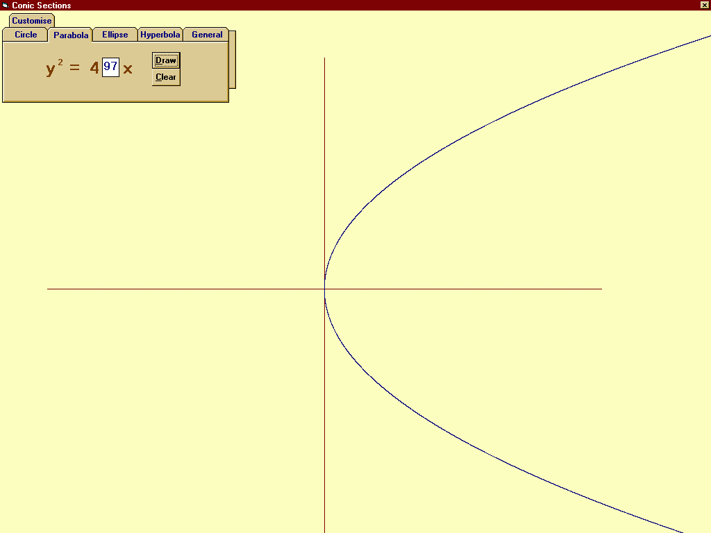

## Curves

### Description

Get instantly the plot for any second degree homogenoug equation in two variables.
 
### More Info
 

             |
---                |---
**Submitted On**   |2007-04-27 15:52:22
**By**             |[Subarno Banerjee](https://github.com/Planet-Source-Code/PSCIndex/blob/master/ByAuthor/subarno-banerjee.md)
**Level**          |Beginner
**User Rating**    |4.0 (8 globes from 2 users)
**Compatibility**  |VB 3\.0, VB 4\.0 \(16\-bit\), VB 4\.0 \(32\-bit\), VB 5\.0, VB 6\.0
**Category**       |[Math/ Dates](https://github.com/Planet-Source-Code/PSCIndex/blob/master/ByCategory/math-dates__1-37.md)
**World**          |[Visual Basic](https://github.com/Planet-Source-Code/PSCIndex/blob/master/ByWorld/visual-basic.md)
**Archive File**   |[Curves2062794282007\.zip](https://github.com/Planet-Source-Code/subarno-banerjee-curves__1-68473/archive/master.zip)

